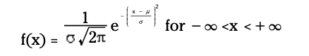
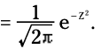
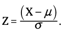

#### Understanding Normal distribution

- Very common probability model used to describe many random phenomena.

- bell-shaped, results mound up in middle, as we move away from the middle on either side, the values occur less often.

- continuous distribution

- differ in terms of its center -> <u>mean</u> and spread -> <u>variance</u>.

- <u>Saddle points</u> places on curve where graph changes from concave down to concave up. Distance from mean is equal to the standard deviation.

- probability density function (pdf)

    

    - very complex to find the area under the curve between 2 points
    - use z table to find find probabilities for any normal distribution

#### Standard Normal (Z) distribution

- Transform any normal distribution to standard normal distribution, basically it is the standard by which all other normal distribution are measured.
- Mean -> 0 and Standard deviation -> 1
- pdf  

###### Standard Scores (z scores / z values)

- Value on the z distribution that represents the number of standard deviations we are above or below the mean.
- z = 1 -> value is 1 sd above from mean, z = -1 -> value is 1 sd below the mean.

###### Changing from X units to Z units

2 Step process:

1. Subtract the mean, to get the normal distribution centered at 0.
2. Divide by the standard deviation to normalize.
3. 

##### Steps for finding probabilities for a normal distribution :

Step 1: Translate into P(x<a), P(x>b) or P(a<x<b)

Step 2: Transform a, b into z values and lookup the value on the z table.

Step 3: If P(x<a) : use the value directly.
			 If P(x>a) : use 1 - z value.

​			 If P(a<x<b): find the z value for b and a. Then subtract the smallest one from the largest one.