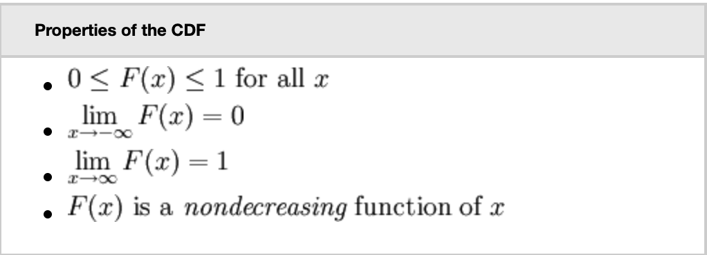
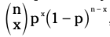

### Foundation

- #### Random Variables

> <u>Discrete</u> : They are the ones which have finite values and can also take countable infinite number of values. 

For example, X may be the total number of time heads turn up when we toss a fair coin 100times or total number of times we call our best friend in a month.

> <u>Continuous</u> : They are the ones which have uncountably infinite number of values - so many that we can't even think about counting them.

For example, measuring the speed of the neutrons in the large hadron collider after a collision experiment or national 8th standard maths average of a country.

- #### Cumulative distribution function (cdf)

Sum of all probabilities for X that are equal to or less than a (value)

- #### Expected Value and Variance

    <u>Expected value</u>: long-term average value after repeating an experiment theoretically infinite number of times.

    - How to calculate:
        - Multiply the value of x by its probability for all X
        - Sum the results.

    <u>Variance</u>: expected amount of variability in our results after repeating an experiment infinite number of times.

    - How to calculate:
        - Subtract E(x) from x, and square, then multiply by the probability.
        - Sum the results.

### Binomial Distribution

- involves only two outcome (yes, no) or (success, failure) or (0, 1)

- Checking conditions:

    - Fixed number of trials
    - Classify the outcome into only two groups
    - Probability of success is same for each trial
    - Independent trials

- pmf = 

    here, n is the fixed number of trials.

    x is the specified number of successes.

    p is the probability of success of any given trial

- cdf = sum the pmf untill x or use the binomial table

