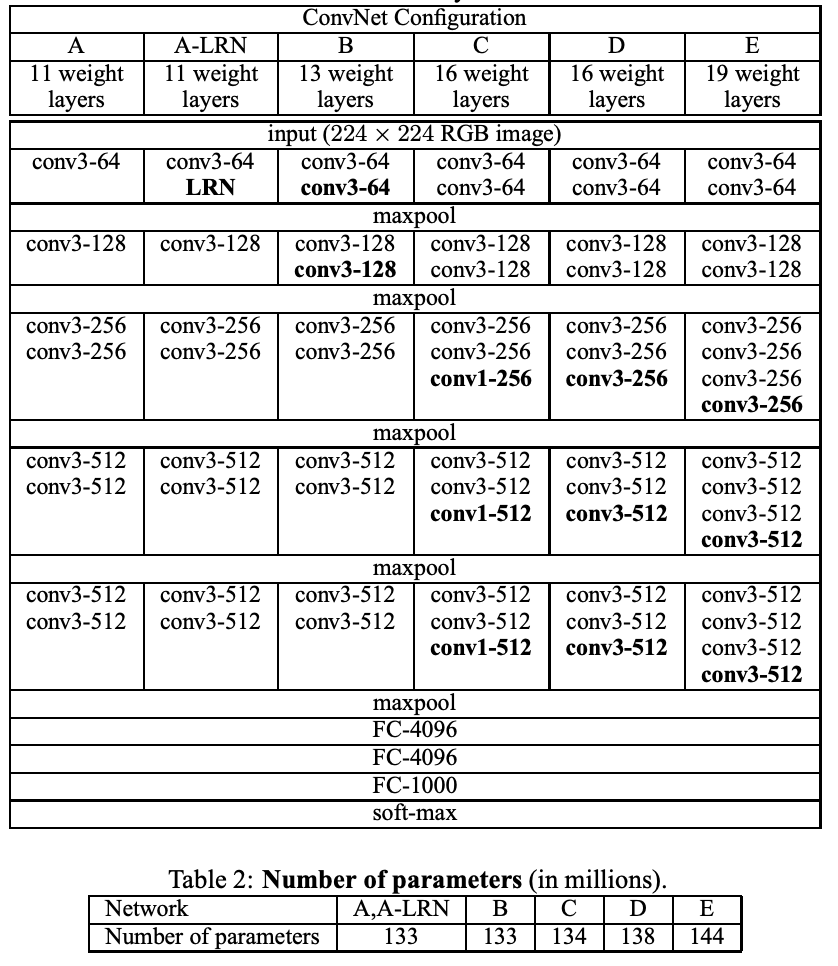
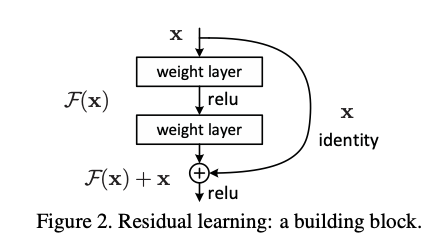
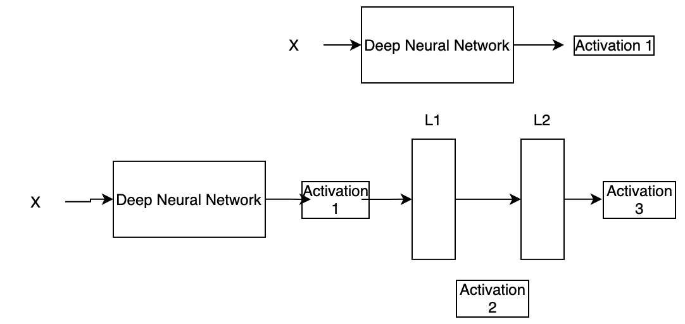

# Brief overview of common CNN architectures

1. VGG
2. Resnet
3. InceptionNet
4. XceptionNet

## VGG

Original Paper: [https://arxiv.org/pdf/1409.1556.pdf](https://arxiv.org/pdf/1409.1556.pdf)

VGG was published in 2014 by Simonyan et al. and in the ImageNet Challenge 2014 submission, his team secured the first and the second places in the localisation and classification tracks.

### Architecture

Below is an image forom the original paper; often the configuration D and E are used in application.

- The input to the convNet is a fixed size 224*224 RGB image.

- Preprocessing: Subtract the mean RGB value, computed on the training set, from each pixel.

- The filters in the convolution layers follow an increasing pattern with a very small receptive field: 3 × 3 (which is the smallest size to capture the notion of left/right, up/down, center).

- The convolution stride is fixed to 1 pixel; the spatial resolution is preserved after convolution, i.e. the padding is 1 pixel for 3 × 3 conv. layers

- The informative features are obtained by max pooling layers applied at different steps in the architecture.

- The dense layers comprise of 4096, 4096 and 1000 nodes each.

- The cons of this architecture is that it is slow to train and produces the model with very large weights.

## Resnet

Original paper: [https://arxiv.org/pdf/1512.03385.pdf](https://arxiv.org/pdf/1512.03385.pdf)

Before Resents, all deep learning models stacked many convolution layers one after the other. At first, this seem to look like the deep networks are performing better. However, it was soon realized that this is not true. Deeper networks face the following problems -

- Network becomes difficult to optimize.
- Vanishing/ Exploding Gradients
- Degradation Problem (Accuracy first saturates and then degrades)

### Skipping connections

*Hypothesis*: Deeper layer should be able to learn something as equal as shallower layers.

Solution - Copying the activation from the shallower layers and set additional layers to identify mapping.

These coneections perform identity function over the activation of shallower layer and produces same activation. The output is then added with the activation of the next layer. To enable these connections we have to keep in mind that the dimentions of convolutions are same throughout the network.

### Advantage

By using the residual blocks in the network, one can construct network of any depths with the hypothesis that new layers are helping to learn underlying patterns in the input data.

### Varities

### why does it works ?

We will consider two networks, first a plain NN and then a more deeper network in which a residual block is added. Therefore, the Activation 1 is being passes to Residual block which in turns gives new Activation 3.

If there was no skip connection, then without any skip connections A3 would be

> Activation 3 = Relu(w2.Activation 2 + b2)

here, w2 and b2 are the weights and bias associated with layer L2. Now with the skip connection another term Activation 1 will be passesd to L2. So the equation of Activation 3 will be modified as:

> Activation 3 = Relu(w2.Activation 2 + b2 + Activation 1)

If we use L2 regularization or the weight decay methods, they will force W2 and b2 to become close to zero. In the worst case, if they become zero, then we would have -

> Activation 3 = Relu(Activation 1) ~ A1 (0 for negatives)

This further indicates that indentity function is easy for residual blocks to learn and the model complexity is not incresed by adding additional residual blocks. Consequently, it may turn out that these additional layers learns something useful -- thereby increasing the performance of the network.